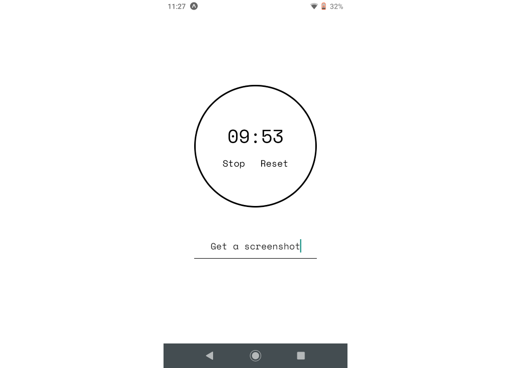

# Sprint Timer
I like using timers to work with urgency/deadlines. For example, take 30 minutes to get done X. But I couldn't find any timers that would let me write a goal (X) for the 30 minutes. And I found writing down my intention/goal helped me stay focused on the task.

So, I built this sprint timer for myself! It uses Expo and React Native, so it can work on Android or iOS. I haven't published on the Play Stores yet, so here's a screenshot.

-----------------------

